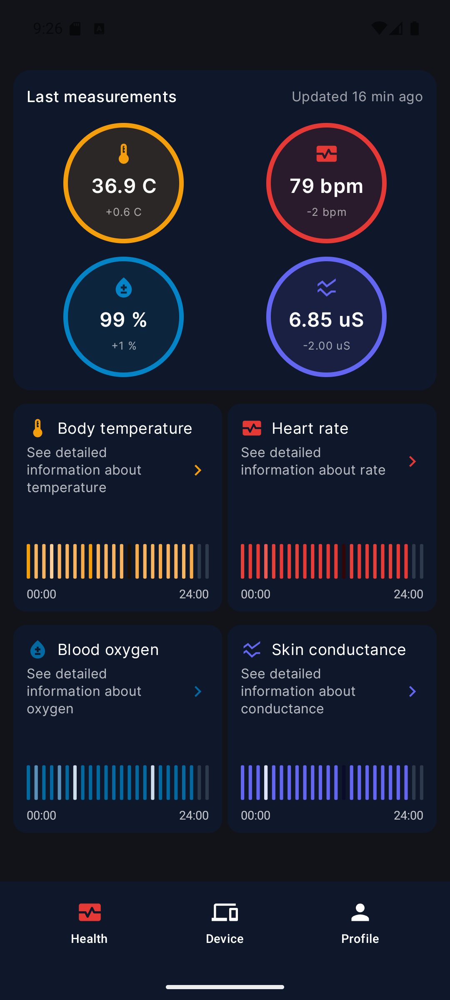
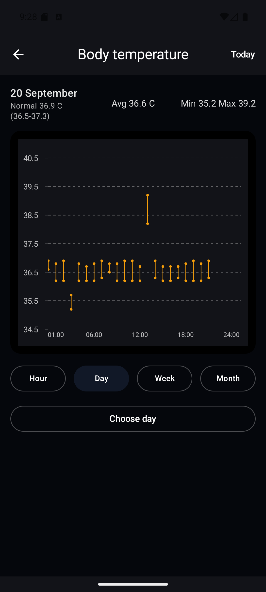
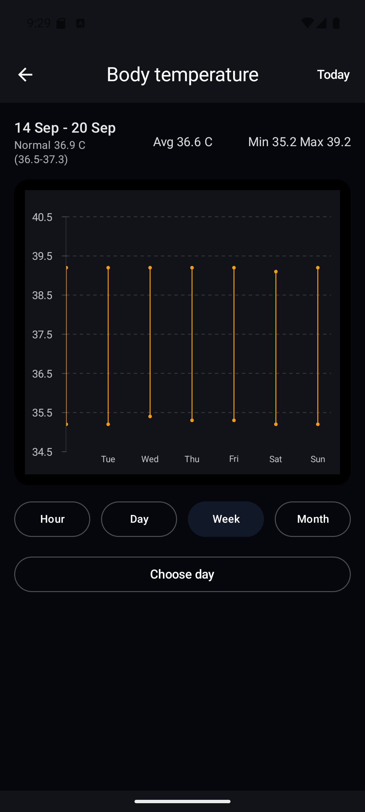
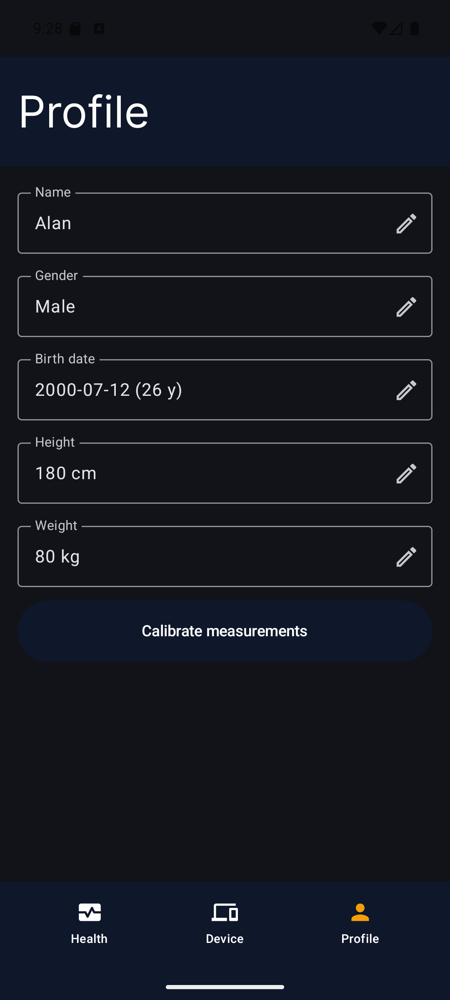

# Smart Band

An Android companion app for a BLE sensor band, developed as an engineering thesis project. It stores measurements locally and displays heart rate, SpO2, temperature, and skin conductance (GSR). The profile, dashboard, and charts can be reviewed without a physical band using automatically generated sample data.

## Screenshots

<p>
  
  
</p>
<p>
  
  
</p>

## Features

- Profile creation and editing: name, gender, date of birth, height, and weight.
- A Health dashboard with recent measurements, changes from previous readings, and daily charts.
- Detailed charts with hour, day, week, and month views, date selection, and average/minimum/maximum summaries.
- Configurable measurement ranges and temperature offset. Automatic range calibration uses valid measurements stored during the last 14 days.
- BLE device discovery, connection, reconnection, and a foreground service for managing the connection while the app is in the background.
- Reception and local storage of measurement packets, plus transmission of time and temperature-offset settings to compatible firmware.

## Stack and architecture

The project contains one Android application module, `:app`, with an MVVM-style structure. Compose screens collect `StateFlow` from ViewModels using lifecycle-aware collection. ViewModels use repository interfaces; repository implementations access Room DAOs and map database entities to application models. Hilt provides repositories, the database, and Bluetooth dependencies.

| Area | Implementation |
| --- | --- |
| Languages | Kotlin 2.0.21; Java for the BLE GATT client and packet parser |
| UI | Jetpack Compose, Material 3, Compose BOM 2025.12.01 |
| Navigation and state | Navigation Compose 2.9.6 with serializable routes; Lifecycle 2.10.0; coroutines, Flow, and StateFlow |
| Persistence | Room 2.8.4; SharedPreferences for saved BLE connection state |
| Dependency injection | Hilt 2.56.2; KSP 2.0.21-1.0.27 |
| Charts and animation | YCharts 2.1.0, custom Compose drawing, Lottie Compose 6.4.0 |
| BLE | Android Bluetooth/GATT APIs; JSON measurement packets parsed with `org.json` |
| Tests | JUnit 4.13.2; AndroidJUnitRunner and AndroidX Test |

The BLE path is `BleUartClient` → `BleConnectionManager` → repositories → Room. Database flows update the dashboard and charts. `BleForegroundService` uses the same connection manager. Mock generation writes through the repositories, so the demo exercises the same storage and display paths as received measurements.

Source code is under `app/src/main/java/pl/edu/pjwstk/engineeringthesis/`:

| Directory | Responsibility |
| --- | --- |
| `view/`, `ui/theme/` | Compose screens, UI components, and theme |
| `viewmodel/` | Screen state, profile onboarding, chart preparation, and mock startup |
| `data/repository/` | Repository interfaces, implementations, and entity mapping |
| `data/db/` | Room database, entities, and DAOs |
| `bluetooth/` | GATT transport, packet parsing, connection management, and foreground service |
| `modules/` | Hilt bindings and providers |
| `model/`, `util/` | Application models, navigation routes, ranges, and measurement helpers |

## Build requirements

| Requirement | Version / configuration |
| --- | --- |
| JDK | 17; the Kotlin toolchain and Java/Kotlin bytecode targets are set to 17 |
| Gradle | 8.11.1, supplied by the Gradle Wrapper |
| Android Gradle Plugin | 8.9.3, as declared in the version catalog |
| Android SDK Platform | API 36 (`compileSdk` and `targetSdk`) |
| SDK Build-Tools | 35.0.0, the AGP 8.9 default; the project does not override it |
| Minimum Android version | Android 9 / API 28 (`minSdk`) |
| IDE | Android Studio Meerkat 2024.3.1 Patch 1 or a later version that supports AGP 8.9 |

The IDE baseline follows the [Android Studio API-level compatibility table](https://developer.android.com/studio/releases#api-level-support). Build-Tools, Gradle, and JDK defaults are documented in the [AGP 8.9 release notes](https://developer.android.com/build/releases/agp-8-9-0-release-notes).

Install the SDK platform and Build-Tools through Android Studio's **SDK Manager**. Install **Android SDK Platform-Tools** for `adb`, and **Android Emulator** plus an API 36 system image for the emulator walkthrough below. The first Gradle sync needs network access to download dependencies. No backend service, account credentials, or API keys need to be configured for the demo.

Clone this repository and open its root directory, which contains `settings.gradle.kts`. Let Android Studio create the machine-specific `local.properties` file. For a command-line setup, create that file with `sdk.dir` pointing to your SDK, for example `sdk.dir=C:/Users/YOUR_USER/AppData/Local/Android/Sdk` on Windows. This file is ignored by Git.

Set `JAVA_HOME` to your JDK 17 installation for terminal builds. In Android Studio, select JDK 17 under **Settings → Build, Execution, Deployment → Build Tools → Gradle → Gradle JDK**. Use the checked-in wrapper; a separate Gradle installation is unnecessary.

From the repository root, build the debug APK:

```powershell
# Windows PowerShell
.\gradlew.bat :app:assembleDebug
```

```bash
# macOS / Linux
bash ./gradlew :app:assembleDebug
```

Output: `app/build/outputs/apk/debug/app-debug.apk`.

The launcher name is **Smart Band**. The Gradle project name remains **Engineering thesis**, and the application ID is `pl.edu.pjwstk.engineeringthesis`.

## Run on an emulator without a band

1. Open the project in Android Studio and complete Gradle sync.
2. In **Tools → Device Manager**, create a phone AVD, such as a Pixel, with an **API 36 Google APIs** system image matching your host architecture. Use an up-to-date Android Emulator and enable hardware virtualization on the host.
3. Start the AVD, select the `app` run configuration and that emulator, then click **Run**.
4. After the splash screen, create a profile by entering a name, gender, date of birth, height, and weight. Input validation currently accepts ages 5–120, heights 100–250 cm, and weights 20–300 kg.
5. Profile completion opens the calibration prompt. Choose **No** to keep the defaults for the initial review, then open **Health**.
6. Allow the asynchronous mock insertion to finish. The four metric cards and charts should populate automatically; there is no seed button or separate setup command.
7. Open each metric and switch between **Hour**, **Day**, **Week**, and **Month**. Select previous dates to inspect historical data. Use **Profile** to edit details or measurement ranges.

Use an AVD with a Bluetooth adapter available to Android. The current Hilt Bluetooth provider expects a non-null adapter even when reviewing mock data, so an image without Bluetooth support can fail during startup. Android documents Classic/BLE emulation for API 31+ in its [emulator networking guide](https://developer.android.com/studio/run/emulator-networking). The mock walkthrough does not require scanning, connecting, or opening the **Device** tab.

### How the mock data works

[`MenuMockSeedTask`](app/src/main/java/pl/edu/pjwstk/engineeringthesis/viewmodel/MenuMockSeedTask.kt) waits for an active profile before generating data. A fresh profile therefore receives mock data automatically after onboarding, without restarting the app.

- The range is the previous **10 calendar days plus today**, with today's timestamps stopping before the time generation starts.
- Samples are generated at **10-minute intervals** for all four metrics, together with combined measurement packets.
- Generation uses the `Europe/Warsaw` time zone. Dashboard and chart date handling uses the device time zone; set the emulator to Warsaw if you want the same day boundaries.
- For each profile and day, each metric/packet table is seeded only if that table has no data for the day. Existing days are not continuously topped up as time passes.
- This is a startup seed operation, not a live BLE simulator. It uses the regular database and is currently enabled without a debug-only guard or a UI toggle. Stored samples have no separate mock/real source flag.

To repeat onboarding, clear **Settings → Apps → Smart Band → Storage → Clear storage** on the emulator and reopen the app. This deletes the local profile and measurements. Uninstalling alone may not give a fresh state: backup is enabled, and Android can restore the database during reinstall. See [Android Auto Backup](https://developer.android.com/identity/data/autobackup).

## Functions that require a real BLE device

Use an Android phone with BLE support and a band implementing the app's protocol to verify discovery, GATT connection, sensor readings, reconnection after a band disconnect/sleep, background connection handling, and firmware application of time/temperature-offset settings. Mock data does not test any of those operations.

On the phone, create a profile, enable Bluetooth, open **Device**, grant the requested permissions, and select the advertising band. The app requests Bluetooth scan/connect permissions on Android 12+ and fine-location permission on older versions.

The band must advertise the expected UART service and expose these characteristics:

| Purpose | UUID |
| --- | --- |
| UART service | `6E400001-B5A3-F393-E0A9-E50E24DCCA9E` |
| Band → app notifications (TX) | `6E400003-B5A3-F393-E0A9-E50E24DCCA9E` |
| App → band writes (RX) | `6E400002-B5A3-F393-E0A9-E50E24DCCA9E` |

Incoming JSON uses `epoch` and numeric arrays named `temp` (or `t`), `hr`, `spo2`, and `gsr`. Outgoing configuration contains `epoch` in seconds and `tempOffsetC`. See [`JsonPacketParser.java`](app/src/main/java/pl/edu/pjwstk/engineeringthesis/bluetooth/JsonPacketParser.java) and [`BleUartClient.java`](app/src/main/java/pl/edu/pjwstk/engineeringthesis/bluetooth/BleUartClient.java) for the implementation. An arbitrary commercial fitness band is not sufficient unless it implements this protocol; firmware is not included in this repository.

Profile editing, local range calibration, and chart review work with stored mock data. Sending the temperature offset and verifying its effect on actual measurements require the compatible band.

## Tests and current coverage

Run local JVM tests without an emulator:

```powershell
.\gradlew.bat :app:testDebugUnitTest
```

```bash
bash ./gradlew :app:testDebugUnitTest
```

With a running emulator or an authorized USB-connected Android device, run the instrumented test:

```powershell
.\gradlew.bat :app:connectedDebugAndroidTest
```

```bash
bash ./gradlew :app:connectedDebugAndroidTest
```

| Test source | Tests | Actual coverage |
| --- | --- | --- |
| [`GsrThresholdsTest`](app/src/test/java/pl/edu/pjwstk/engineeringthesis/util/GsrThresholdsTest.kt) | 2 JVM tests | GSR validity boundaries (`0 < value < 100`) and display normalization for zero, valid, and over-range values |
| [`ExampleUnitTest`](app/src/test/java/pl/edu/pjwstk/engineeringthesis/ExampleUnitTest.kt) | 1 JVM test | Template arithmetic assertion, `2 + 2 == 4` |
| [`ExampleInstrumentedTest`](app/src/androidTest/java/pl/edu/pjwstk/engineeringthesis/ExampleInstrumentedTest.kt) | 1 device test | Checks the application context package name |

There are no automated tests for onboarding, mock generation, ViewModels, Compose navigation/screens, chart aggregation, Room migrations, calibration, or BLE transport/reconnection. The presence of Compose, Espresso, navigation, and Room testing dependencies does not mean those paths are covered. No percentage-based coverage report is configured.

Gradle HTML reports are written to `app/build/reports/tests/testDebugUnitTest/index.html` and, after a connected test run, `app/build/reports/androidTests/connected/debug/index.html`.

During final verification, `:app:assembleDebug` and `:app:testDebugUnitTest` passed on Windows with JDK 17. The application was also manually verified on an Android emulator running API 36 with Google APIs. The verified flow included clean onboarding and profile creation, the Health dashboard with all four metrics, detailed charts with multiple time ranges, profile editing, and persistence after application restart. Physical BLE communication with the smart band and the connected instrumented test were not re-verified during this emulator review.

## Persistence limitation

The Room database is currently version 23. [`DbModule`](app/src/main/java/pl/edu/pjwstk/engineeringthesis/modules/DbModule.kt) registers several migrations through version 22 and enables destructive fallback, but does not supply a 22 → 23 migration. An upgrade without a migration path recreates the Room-managed tables and loses their previous data. Use a disposable profile/database when reviewing the current demo.
